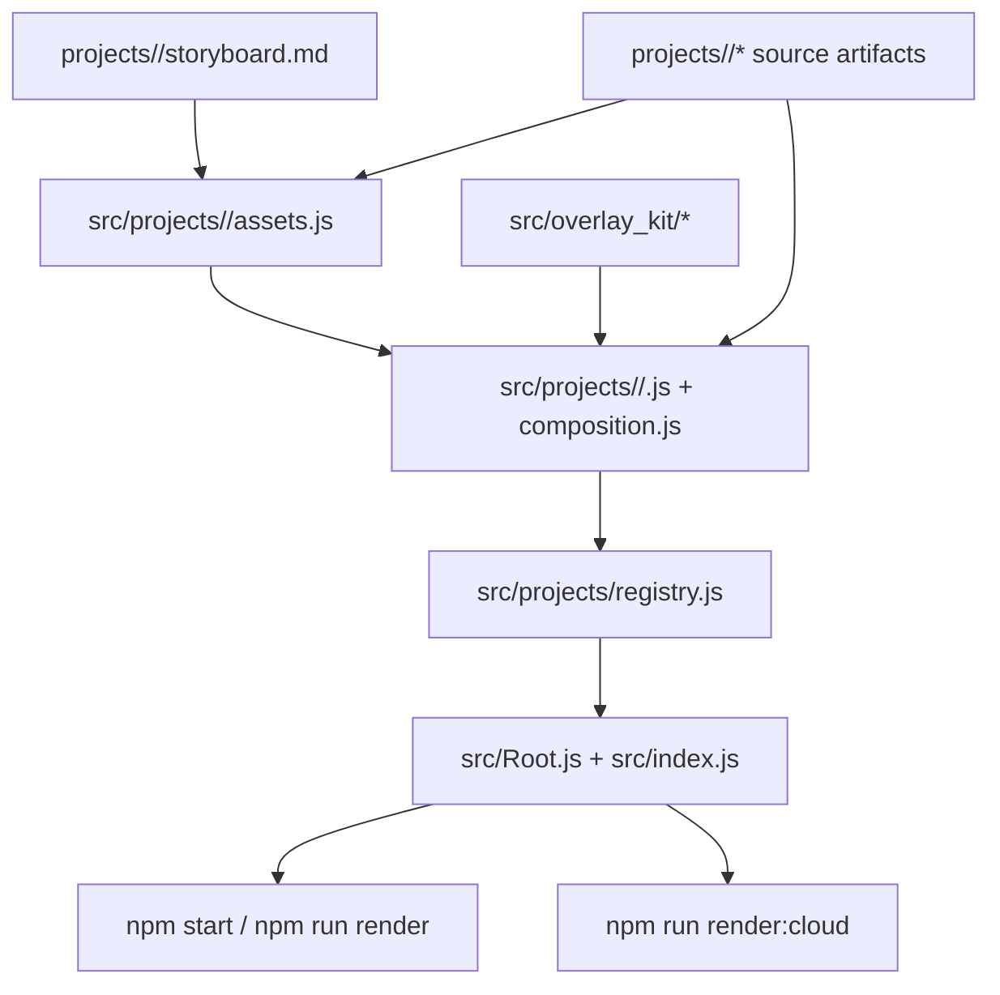

# Video Project Model

This repo separates editable source artifacts from runtime Remotion code. Each
video project keeps reference material under `projects/<id>/`, runtime code
under `src/projects/<id>/`, and a central registry wires those compositions
into Studio and render entrypoints.

## Main Parts

- `projects/<id>/`: reference-only source material and notes such as storyboards,
  transcripts, masks, and handoff docs.
- `src/projects/<id>/`: runtime composition code. `assets.js` holds durable
  inputs, `<ProjectComp>.js` wires scenes, and `composition.js` exports the
  composition config.
- `src/overlay_kit/`: reusable overlays and drawing primitives shared across
  projects.
- `src/projects/registry.js` plus `src/Root.js`: the only path that turns a
  project into an active Remotion composition.
- `scripts/*.mjs`: local entrypoints for Studio, render slices, scaffolding, and
  repo validation.

## Main Flow

1. Capture editable notes and source artifacts in `projects/<id>/`.
2. Translate the runtime inputs into `src/projects/<id>/assets.js` and
   composition code.
3. Register the project in `src/projects/registry.js`; `src/Root.js` renders
   every registered composition.
4. Run `npm start` or `npm run render -- ...` through the cached local scripts.
   Those scripts scan `assets.js`, prepare local cache data, and launch Remotion
   with the resolved props and public dir.
5. Use cloud rendering only after the local loop is stable.

## Boundaries

- Runtime inputs for a composition live in code under `src/projects/<id>/`;
  scratch manifests in `projects/<id>/` stay reference-only.
- Every project exports one composition config from
  `src/projects/<id>/composition.js`.
- `src/projects/registry.js` remains the source of truth for active
  compositions, and `src/Root.js` must keep rendering `PROJECT_COMPOSITIONS`.
- Older project code can remain imported in the registry with `enabled: false`
  so it stays available in-repo without appearing in Studio.
- Reusable overlays belong in `src/overlay_kit/`; one-off scene wiring stays in
  project folders.
- Major visual beats should be wrapped in named `<Sequence>` blocks for Studio
  timeline legibility.
- Active execution state belongs in `docs/projects/<project>/tasks.md`, not in
  source folders.

## Related References

- `docs/references/project-contract.md`
- `docs/references/repo-operations.md`
- `docs/references/verification-loop.md`
